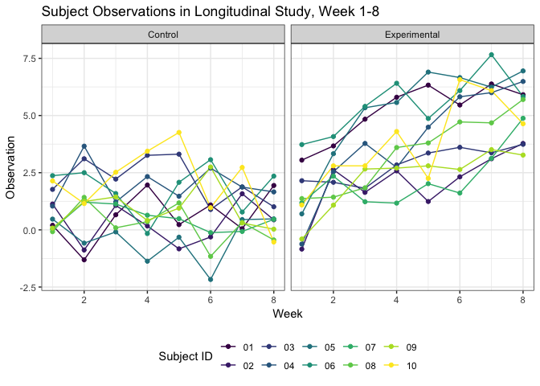
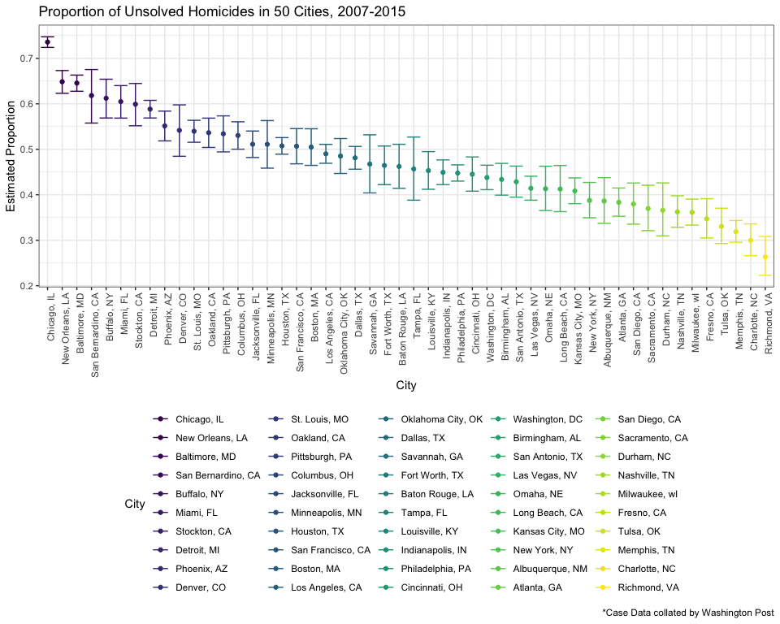

p8105\_hw5\_jh4054
================
Joy Hsu
11/5/2018

This R Markdown for HW5 reinforces skills from the Iteration Module

### 0. Setup

### Problem 1

The first dataset consists of observations for 20 participants in a longitudinal study, 10 in the control arm and 10 in the experimental arm.

``` r
#read in csv files. Tidy week and observations as single variables. 
patient_df = 
  tibble(
    id = c(str_c("con_0", 01:9), "con_10", str_c("exp_0", 01:9), "exp_10"),
    csv = list.files("./data/patient", full.names = TRUE),
    data = map(csv, read_csv)) %>% 
  unnest() %>% 
  janitor::clean_names() %>% 
  gather(key = week, value = observation, week_1:week_8) %>% 
  mutate(week = str_replace(week, "week_", ""),
         arm = str_replace(id, "_..", ""),
         id = str_replace(id, "..._", ""),
         week = as.integer(as.factor(week)),
         id = as.factor(id)) %>% 
  select(arm, id, week, observation) %>%
  arrange(arm, id, week)
## Parsed with column specification:
## cols(
##   week_1 = col_double(),
##   week_2 = col_double(),
##   week_3 = col_double(),
##   week_4 = col_double(),
##   week_5 = col_double(),
##   week_6 = col_double(),
##   week_7 = col_double(),
##   week_8 = col_double()
## )
## Parsed with column specification:
## cols(
##   week_1 = col_double(),
##   week_2 = col_double(),
##   week_3 = col_double(),
##   week_4 = col_double(),
##   week_5 = col_double(),
##   week_6 = col_double(),
##   week_7 = col_double(),
##   week_8 = col_double()
## )
## Parsed with column specification:
## cols(
##   week_1 = col_double(),
##   week_2 = col_double(),
##   week_3 = col_double(),
##   week_4 = col_double(),
##   week_5 = col_double(),
##   week_6 = col_double(),
##   week_7 = col_double(),
##   week_8 = col_double()
## )
## Parsed with column specification:
## cols(
##   week_1 = col_double(),
##   week_2 = col_double(),
##   week_3 = col_double(),
##   week_4 = col_double(),
##   week_5 = col_double(),
##   week_6 = col_double(),
##   week_7 = col_double(),
##   week_8 = col_double()
## )
## Parsed with column specification:
## cols(
##   week_1 = col_double(),
##   week_2 = col_double(),
##   week_3 = col_double(),
##   week_4 = col_double(),
##   week_5 = col_double(),
##   week_6 = col_double(),
##   week_7 = col_double(),
##   week_8 = col_double()
## )
## Parsed with column specification:
## cols(
##   week_1 = col_double(),
##   week_2 = col_double(),
##   week_3 = col_double(),
##   week_4 = col_double(),
##   week_5 = col_double(),
##   week_6 = col_double(),
##   week_7 = col_double(),
##   week_8 = col_double()
## )
## Parsed with column specification:
## cols(
##   week_1 = col_double(),
##   week_2 = col_double(),
##   week_3 = col_double(),
##   week_4 = col_double(),
##   week_5 = col_double(),
##   week_6 = col_double(),
##   week_7 = col_double(),
##   week_8 = col_double()
## )
## Parsed with column specification:
## cols(
##   week_1 = col_double(),
##   week_2 = col_double(),
##   week_3 = col_double(),
##   week_4 = col_double(),
##   week_5 = col_double(),
##   week_6 = col_double(),
##   week_7 = col_double(),
##   week_8 = col_double()
## )
## Parsed with column specification:
## cols(
##   week_1 = col_double(),
##   week_2 = col_double(),
##   week_3 = col_double(),
##   week_4 = col_double(),
##   week_5 = col_double(),
##   week_6 = col_double(),
##   week_7 = col_double(),
##   week_8 = col_double()
## )
## Parsed with column specification:
## cols(
##   week_1 = col_double(),
##   week_2 = col_double(),
##   week_3 = col_double(),
##   week_4 = col_double(),
##   week_5 = col_double(),
##   week_6 = col_double(),
##   week_7 = col_double(),
##   week_8 = col_double()
## )
## Parsed with column specification:
## cols(
##   week_1 = col_double(),
##   week_2 = col_double(),
##   week_3 = col_double(),
##   week_4 = col_double(),
##   week_5 = col_double(),
##   week_6 = col_double(),
##   week_7 = col_double(),
##   week_8 = col_double()
## )
## Parsed with column specification:
## cols(
##   week_1 = col_double(),
##   week_2 = col_double(),
##   week_3 = col_double(),
##   week_4 = col_double(),
##   week_5 = col_double(),
##   week_6 = col_double(),
##   week_7 = col_double(),
##   week_8 = col_double()
## )
## Parsed with column specification:
## cols(
##   week_1 = col_double(),
##   week_2 = col_double(),
##   week_3 = col_double(),
##   week_4 = col_double(),
##   week_5 = col_double(),
##   week_6 = col_double(),
##   week_7 = col_double(),
##   week_8 = col_double()
## )
## Parsed with column specification:
## cols(
##   week_1 = col_double(),
##   week_2 = col_double(),
##   week_3 = col_double(),
##   week_4 = col_double(),
##   week_5 = col_double(),
##   week_6 = col_double(),
##   week_7 = col_integer(),
##   week_8 = col_double()
## )
## Parsed with column specification:
## cols(
##   week_1 = col_double(),
##   week_2 = col_double(),
##   week_3 = col_double(),
##   week_4 = col_double(),
##   week_5 = col_double(),
##   week_6 = col_double(),
##   week_7 = col_double(),
##   week_8 = col_double()
## )
## Parsed with column specification:
## cols(
##   week_1 = col_double(),
##   week_2 = col_double(),
##   week_3 = col_double(),
##   week_4 = col_double(),
##   week_5 = col_double(),
##   week_6 = col_double(),
##   week_7 = col_double(),
##   week_8 = col_double()
## )
## Parsed with column specification:
## cols(
##   week_1 = col_double(),
##   week_2 = col_double(),
##   week_3 = col_double(),
##   week_4 = col_double(),
##   week_5 = col_double(),
##   week_6 = col_double(),
##   week_7 = col_double(),
##   week_8 = col_double()
## )
## Parsed with column specification:
## cols(
##   week_1 = col_double(),
##   week_2 = col_double(),
##   week_3 = col_double(),
##   week_4 = col_double(),
##   week_5 = col_double(),
##   week_6 = col_double(),
##   week_7 = col_double(),
##   week_8 = col_double()
## )
## Parsed with column specification:
## cols(
##   week_1 = col_double(),
##   week_2 = col_double(),
##   week_3 = col_double(),
##   week_4 = col_double(),
##   week_5 = col_double(),
##   week_6 = col_double(),
##   week_7 = col_double(),
##   week_8 = col_double()
## )
## Parsed with column specification:
## cols(
##   week_1 = col_double(),
##   week_2 = col_double(),
##   week_3 = col_double(),
##   week_4 = col_double(),
##   week_5 = col_double(),
##   week_6 = col_double(),
##   week_7 = col_double(),
##   week_8 = col_double()
## )
```

``` r
#linear model for experimental group
lm(observation ~ week, data = filter(patient_df, arm == "exp")) %>% broom::tidy() %>% mutate(sig = p.value < 0.05)
## # A tibble: 2 x 6
##   term        estimate std.error statistic  p.value sig  
##   <chr>          <dbl>     <dbl>     <dbl>    <dbl> <lgl>
## 1 (Intercept)    1.27     0.383       3.33 1.34e- 3 TRUE 
## 2 week           0.526    0.0758      6.95 9.96e-10 TRUE

#linear model for control group
lm(observation ~ week, data = filter(patient_df, arm == "con")) %>% broom::tidy() %>% mutate(sig = p.value < 0.05)
## # A tibble: 2 x 6
##   term        estimate std.error statistic  p.value sig  
##   <chr>          <dbl>     <dbl>     <dbl>    <dbl> <lgl>
## 1 (Intercept)   1.18      0.318      3.72  0.000377 TRUE 
## 2 week         -0.0369    0.0630    -0.585 0.560    FALSE
```

``` r
#Create spaghetti plot of participant observations week 1-8, in both arms
patient_df %>% 
  mutate(
    arm = str_replace(arm, "exp", "Experimental"),
    arm = str_replace(arm, "con", "Control")) %>% 
  group_by(id) %>% 
  ggplot(aes(x = week, y = observation, color = id)) +
  geom_line() +
  geom_point() +
  facet_grid(~arm) +
  labs(
    title = "Subject Observations in Longitudinal Study, Week 1-8",
    x = "Week",
    y = "Observation") + 
  viridis::scale_color_viridis(
    name = "Subject ID", 
    discrete = TRUE) +
  theme_bw() +
  theme(legend.position = "bottom")
```



In the experimental group, subject observation values trend upwards from weeks 1-8. A simple linear model fit for observation by week gives an estimated beta1 of 0.53, p.value &lt; 0.05.

In the control group, no significant trend is observed for subject observation values from weeks 1-8. There does not appear to be a significant correlation between weeks and change in observation.

### Problem 2

The homicide dataset was collated by Washington Post on 52179 homicide cases in 50 major US cities, from 2007 to 2015. Altogether, 28 states are represented. The raw dimensions are 52179 rows by 12 columns variables. Each case is reported as a distinct row, with demographic information on the victim's name, age, sex, and race. Attributes regarding the homicide incident include geospatial coordinates, reported date, city, and disposition of the police case.

``` r
#examine raw dataset
raw_dataset = read_csv("./data/homicide-data.csv")
## Parsed with column specification:
## cols(
##   uid = col_character(),
##   reported_date = col_integer(),
##   victim_last = col_character(),
##   victim_first = col_character(),
##   victim_race = col_character(),
##   victim_age = col_character(),
##   victim_sex = col_character(),
##   city = col_character(),
##   state = col_character(),
##   lat = col_double(),
##   lon = col_double(),
##   disposition = col_character()
## )
dim(raw_dataset)
## [1] 52179    12

#represented states and cities
raw_dataset %>% 
  distinct(state) %>% 
  nrow()
## [1] 28

raw_dataset %>% 
  distinct(city) %>% 
  nrow()
## [1] 50
```

``` r
#load and tidy dataset
#Correct State affiliation for one homicide case in Tulsa, OK. Original case had incorrect state as Tulsa, AL
homicide_data = read_csv("./data/homicide-data.csv") %>% 
  janitor::clean_names() %>% 
  mutate(
    city_state = str_c(city, ", ", state),
    city_state = str_replace(city_state, "Tulsa, AL", "Tulsa, OK"),
    hom_unsolved = ifelse(disposition != "Closed by arrest", 1, 0))
## Parsed with column specification:
## cols(
##   uid = col_character(),
##   reported_date = col_integer(),
##   victim_last = col_character(),
##   victim_first = col_character(),
##   victim_race = col_character(),
##   victim_age = col_character(),
##   victim_sex = col_character(),
##   city = col_character(),
##   state = col_character(),
##   lat = col_double(),
##   lon = col_double(),
##   disposition = col_character()
## )

#total homicides
homicide_total = homicide_data %>% 
  group_by(city_state) %>% 
  summarise(hom_total = n())

#total unsolved homicides
homicide_unsolve = homicide_data %>% 
  group_by(city_state) %>% 
  summarise(hom_unsolved = sum(hom_unsolved))

#join dataframes for total homicides and unsolved homicides
homicide_tidy = left_join(homicide_total, homicide_unsolve)
## Joining, by = "city_state"
```

#### 2.1 Proportion Test for Baltimore

In Baltimore, the estimated proportion of unsolved homicides cases (disposition as “Closed without arrest” or “Open/No arrest”) is 0.65, with a 95% Confidence Interval of (0.63, 0.66).

``` r
#Proportion test for Baltimore
prop_test_baltimore = homicide_tidy %>% 
  filter(city_state == "Baltimore, MD") %>% 
  with(., prop.test(n = hom_total, x = hom_unsolved)) %>% 
  broom::tidy() %>% 
  select(estimate, conf.low, conf.high)
prop_test_baltimore %>% kable(digits = 2)
```

|  estimate|  conf.low|  conf.high|
|---------:|---------:|----------:|
|      0.65|      0.63|       0.66|

#### 2.2 Proportion Unsolved Homicides, All Cities

We run the proportion test for all 50 cities and construct a 95% confidence interval for the estimated proportion of unsolved homicides. In the plot below, cities are arranged in descending order of proportion.

``` r
prop_test_all = homicide_tidy %>% 
  mutate(prop = map2(.x = hom_total, .y = hom_unsolved, ~prop.test(n = .x, x = .y)),
         prop = map(prop, broom::tidy)) %>% 
  unnest() %>% 
  select(city_state, estimate, conf.low, conf.high) %>% 
  mutate(city_state = fct_reorder(city_state, desc(estimate)))

prop_test_plot = prop_test_all %>% 
  ggplot(aes(x = city_state, y = estimate, color = city_state)) +
  geom_point() +
  geom_errorbar(mapping = aes(x = city_state, ymin = conf.low, ymax = conf.high)) + 
  labs(
    title = "Proportion of Unsolved Homicides in 50 Cities, 2007-2015",
    x = "City",
    y = "Estimated Proportion",
    caption = "*Case Data collated by Washington Post") + 
  viridis::scale_color_viridis(
    name = "City", 
    discrete = TRUE) +
  theme_bw() +
  theme(axis.text.x = element_text(angle = 90, hjust = 1), 
        legend.position = "bottom")
prop_test_plot
```


